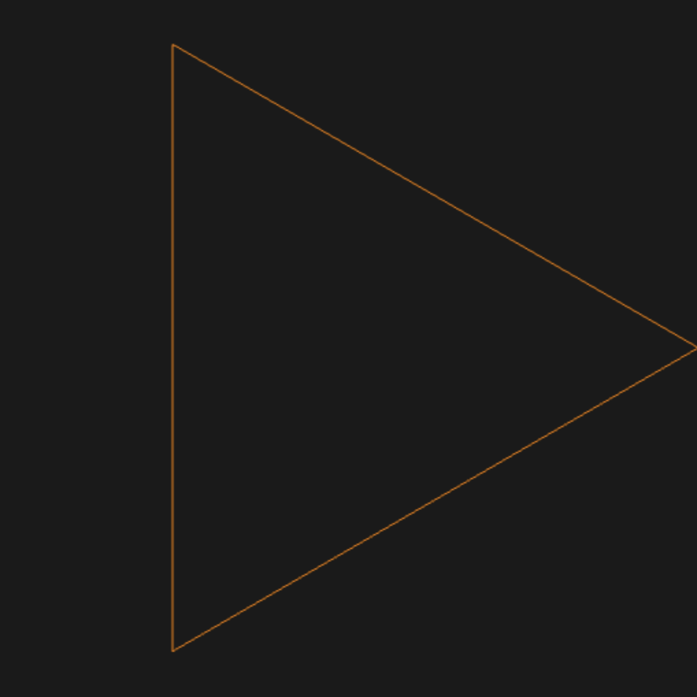
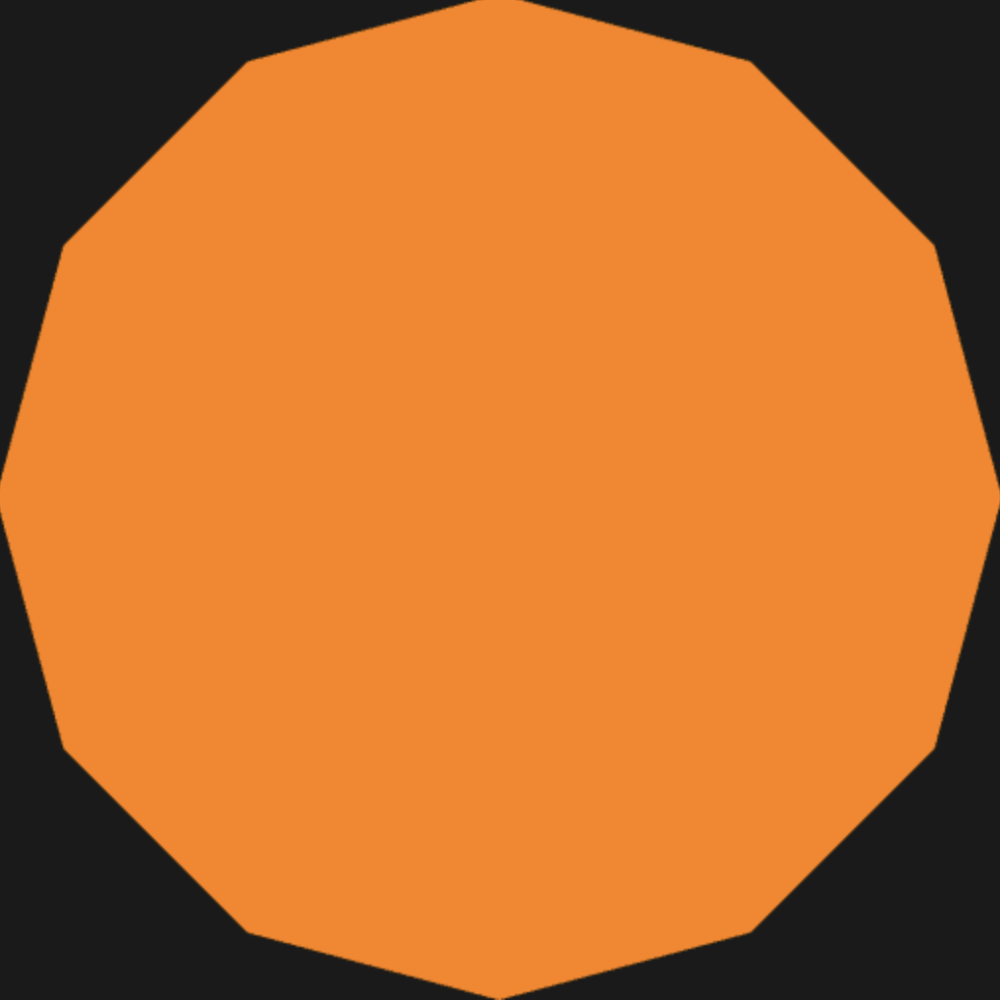

# Project 3 — Procedural WebGL Shapes

A small set of WebGL 2 pages that procedurally generate geometry inside the
vertex shader (no vertex buffers), starting from an empty grey canvas and
evolving into a colored, rotating five-pointed star.

Each version is a copy of the previous one with small targeted edits — open
them in order to see the progression.

## Versions

Click any thumbnail to open the live page.

### 1. Wireframe triangle

[](triangle.html)

`gl.LINE_LOOP` over three procedurally generated vertices.

### 2. 10-sided filled disk

[](disk.html)

Switches to `gl.TRIANGLE_FAN`, replaces the magic `3.0` with the `N` uniform.

### 3. Five-pointed star

[](star.html)

Pins `gl_VertexID == 0` to the origin and alternates outer/inner radius based
on vertex parity.

### 4. Rotating five-pointed star

[](star-rotating.html)

Adds a `t` uniform that ticks each frame and feeds into the angle computation.

### 5. Colored rotating star (extra credit)

[](star-colored.html)

Passes `radius` from the vertex shader to the fragment shader and uses `mix`
to interpolate between two colors across each triangle.

## How to view

Either open the `.html` files directly in a WebGL 2 capable browser, or run a
local web server from this directory:

```bash
python -m http.server
```

then visit <http://localhost:8000/>.

## Files

- `start.html`, `start-commented.html` — original starter scaffolding (kept for
  reference).
- `initShaders.js` — helper that compiles and links the inline shaders, and
  auto-injects `#version 300 es` / `precision highp float;` as needed.
