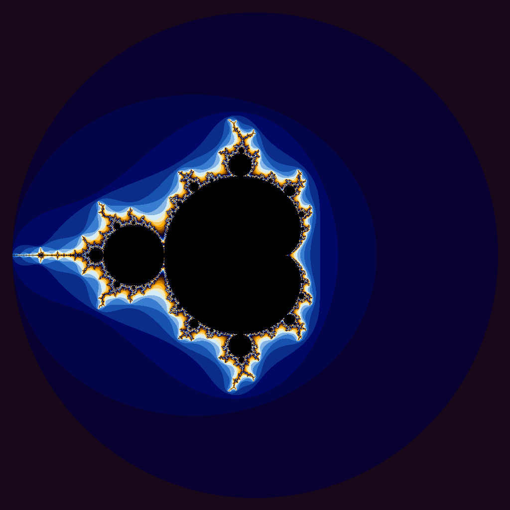

# Project 4 — Hello CUDA

Two small CUDA programs for our first taste of GPU programming. Everything was
built and timed on the class Oblivus machine (an NVIDIA RTX A6000).

Build everything with the provided Makefile:

```bash
make            # builds iota.cpu, iota.gpu, julia.cpu, julia.gpu
./runTrials.sh ./iota.cpu
./runTrials.sh ./iota.gpu
./julia.gpu     # writes julia.ppm
```

---

## Part 1 — `iota`

`iota.cpp` is the CPU version. It makes a `std::vector<long>` of length `N`,
fills it using `std::iota`, and then spot-checks 500 entries to make sure
nothing went wrong.

`iota.cu` is the CUDA version. The `main()` was given to us — I just added the
kernel. The kernel uses one thread per element: each thread figures out its
own index `i` and writes `i + startValue` into the output buffer.

```17:23:Project-4/iota.cu
__global__
void iota(Count n, DataType* values, DataType startValue) {
    Count i = blockIdx.x * blockDim.x + threadIdx.x;
    if (i < n) {
        values[i] = static_cast<DataType>(i) + startValue;
    }
}
```

The launch uses 256 threads per block and enough blocks to cover `N` (the
last block has a few extra threads, which is why the kernel has the
`if (i < n)` guard):

```39:41:Project-4/iota.cu
int chunkSize = 256;
int numChunks = int((float) numValues / chunkSize + 1);
iota<<<numChunks, chunkSize>>>(numValues, gpuValues, startValue);
```

### Timings

Output from `./runTrials.sh`, in seconds (wall / user / system).

#### CPU — `./iota.cpu`

| Vector<br>Length | Wall Clock<br>Time | User Time | System Time |
|:--:|--:|--:|--:|
|10| 0.00| 0.00| 0.00|
|100| 0.00| 0.00| 0.00|
|1000| 0.00| 0.00| 0.00|
|10000| 0.00| 0.00| 0.00|
|100000| 0.00| 0.00| 0.00|
|1000000| 0.00| 0.00| 0.00|
|5000000| 0.02| 0.00| 0.02|
|100000000| 0.58| 0.10| 0.47|
|500000000| 2.94| 0.48| 2.46|
|1000000000| 5.82| 0.91| 4.90|
|5000000000|33.42| 5.84|27.57|

#### GPU — `./iota.gpu`

| Vector<br>Length | Wall Clock<br>Time | User Time | System Time |
|:--:|--:|--:|--:|
|10| 0.34| 0.01| 0.31|
|100| 0.24| 0.01| 0.21|
|1000| 0.24| 0.01| 0.21|
|10000| 0.26| 0.01| 0.22|
|100000| 0.24| 0.00| 0.22|
|1000000| 0.25| 0.01| 0.22|
|5000000| 0.28| 0.02| 0.24|
|100000000| 0.87| 0.15| 0.70|
|500000000| 3.47| 0.73| 2.71|
|1000000000| 6.64| 1.46| 5.15|
|5000000000|42.17|11.52|30.65|

### Were the results what I expected?

Honestly, no — I assumed the GPU would win once the vector got big enough.
But the CPU actually beats the GPU on every single row. A couple of things
stood out:

- For small `N`, the CPU finishes too fast for `time` to even register
  (0.00 s), while the GPU is stuck at ~0.24 s no matter what. That floor
  is just CUDA starting up — loading the driver, creating a context, etc.
  It happens once and has nothing to do with the actual work.
- For large `N`, both versions get slower, but the GPU is always a few
  seconds behind. At `N = 10⁹` it's 6.64 s vs 5.82 s; at `N = 5 × 10⁹`
  it's 42.17 s vs 33.42 s.

### Why isn't CUDA great for `iota`?

`iota` barely does any math — one add and one store per element, and no
element gets reused. So the runtime is really about *moving bytes around*,
not computing.

The CPU version just writes the bytes straight into memory and is done.
The GPU version has to:

1. Copy the buffer from the CPU over to the GPU (PCIe transfer).
2. Run the kernel, which writes the result on the GPU.
3. Copy the result back from the GPU to the CPU (another PCIe transfer).

The kernel itself is super fast, but the two PCIe trips are slow compared
to just writing to regular memory once. So the GPU ends up doing more
work, not less, for this kind of problem. CUDA only really pays off when
each element needs a lot of math (like the Julia kernel below) — not when
you're just filling a buffer.

---

## Part 2 — Julia / Mandelbrot set

`julia.cpp` walks every pixel of a 1024×1024 image. For each pixel it
repeatedly applies `z ← z² + c` until either `|z|` gets bigger than 2 or
it hits the iteration cap, then it colors the pixel based on how many
iterations that took. With the starting value `z = (0, 0)` the result is
the Mandelbrot set.

`julia.cu` does the exact same thing, but with one CUDA thread per pixel.
The launch is 2D — 32×32 threads per block, 32×32 blocks — which works
out to exactly 1024×1024 threads, one for each pixel.

```174:194:Project-4/julia.cu
__global__
void julia(Complex d, Complex center, Color* pixels) {
    int x = blockIdx.x * blockDim.x + threadIdx.x;
    int y = blockIdx.y * blockDim.y + threadIdx.y;

    if (x >= Width || y >= Height) { return; }

    Complex c(x * d.x, y * d.y);
    c -= center;
    Complex z(0, 0);

    int iter = 0;
    while (iter < MaxIterations && magnitude(z) < 2.0f) {
        z = z*z + c;
        ++iter;
    }

    pixels[x + y * Width] = setColor(iter);
}
```

### Porting notes

Two small gotchas when copying the CPU code into the kernel:

- `std::complex<float>` uses `.real()` / `.imag()`, but the CUDA version
  in the starter (`TComplex<float>`) uses `.x` / `.y` instead. The
  `magnitude()` helper above the kernel already smooths this over for the
  loop body itself.
- `TComplex()` (the no-argument constructor) isn't tagged with
  `__device__`, so I couldn't just write `Complex z;` inside the kernel.
  I called the two-argument constructor instead: `Complex z(0, 0)`.

### Image

Starting point: $z_0 = (0, 0)$, which makes this the **Mandelbrot set**.



---

## Files

- `iota.cpp` — CPU version using `std::iota`.
- `iota.cu` — CUDA version; same `main()` as the CPU one, with the kernel
  added.
- `julia.cpp` — CPU version that generates the Mandelbrot/Julia image.
- `julia.cu` — CUDA version of the same.
- `Makefile` — builds `*.cpu` from `*.cpp` and `*.gpu` from `*.cu`.
- `runTrials.sh` — runs each program at a list of vector sizes and prints
  a Markdown timing table.
- `CudaCheck.h` — provides the `CUDA_CHECK_CALL` / `CUDA_CHECK_KERNEL`
  macros used in `julia.cu`.
- `iota_cpu.md`, `iota_gpu.md` — raw timing output from `runTrials.sh`.
- `julia.png` — the rendered Mandelbrot image (converted from `julia.ppm`
  with ImageMagick).
